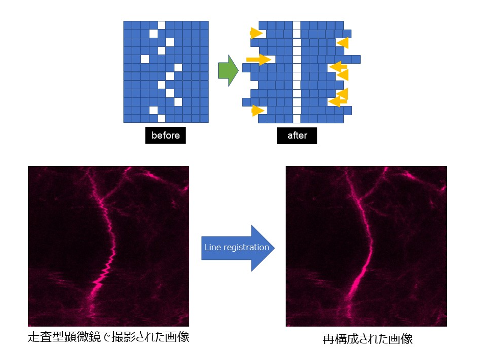

# line-registration
reconstruct the scan image to modify the slipping to horizontal direction

MATLAB code and ImageJ plugin are available.　Implementation can be done with either side.

MATLABとImageJ pluginの２つのコードがあります。どちらでも好きな方で利用可能です。

## Dependencies
MATLAB or ImageJ(Fiji)

## Author
Takehiro Ajioka 

E-mail:1790651m@stu.kobe-u.ac.jp

## Affiliation

Division of System Neuroscience, Kobe University of Graduate School of Medicine

神戸大学医学研究科システム生理学分野
